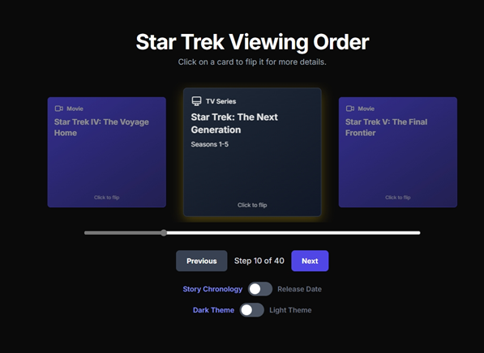
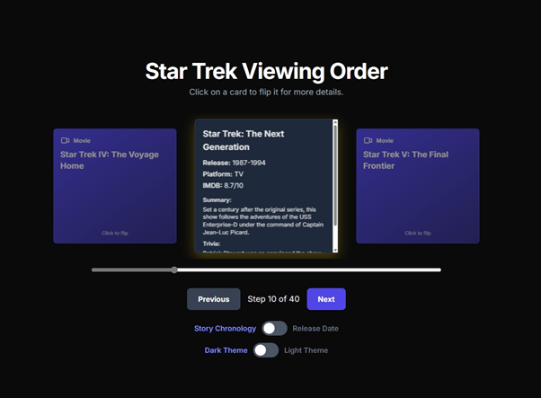
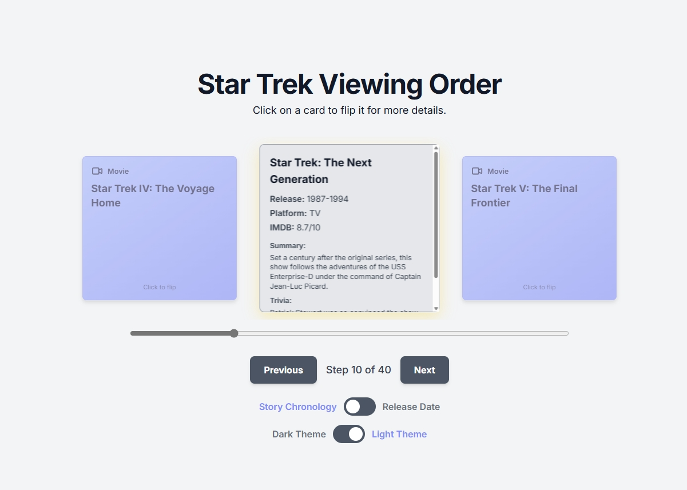

# ⭐ Interactive Star Trek Viewing Order

Welcome to the **Star Trek Viewing Order** project! This interactive timeline helps fans explore the Star Trek universe in both story chronology and release order, with beautiful flip cards, theme toggles, and a modern responsive design.





## 🚀 Features
- **Interactive Timeline Carousel**: Flip through series, movies, and crossovers.
- **Flip Cards**: Click to reveal more details about each entry.
- **Theme Toggle**: Instantly switch between dark and light modes.
- **Order Toggle**: View by story chronology or original release date.
- **Responsive Design**: Works great on desktop and mobile.
- **Accessible**: Keyboard navigable and screen reader friendly.


## 🗂️ Project Structure

```
Star_Trek_View_Order/
├── index.html                # Main HTML file
├── css/
│   └── style.css             # Custom styles (dark/light theme, carousel, cards)
├── js/
│   └── main.js               # Main JavaScript (timeline, theme, interactivity)
├── assets/
│   └── images/
│       ├── Light_theme.png
│       ├── Movie&TV_Show_Cards.png
│       ├── Trivia_Cards.png
│       └── jpeg/
│           ├── Light_theme.jpeg
│           ├── Movie&TV_Show_Cards.jpeg
│           └── Trivia_Cards.jpeg
├── LICENSE                   # Open source license (MIT)
├── README.md                 # Project documentation
└── ...
```

## 🛠️ Tech Stack
- **HTML5 & CSS3** (with [Tailwind CSS](https://tailwindcss.com/))
- **JavaScript** (Vanilla, no frameworks)
- **Google Fonts** ([Inter](https://fonts.google.com/specimen/Inter))

## 🌟 Get Started
1. **Clone the repository:**
   ```sh
   git clone https://github.com/your-username/Star_Trek_View_Order.git
   cd Star_Trek_View_Order
   ```
2. **Open `index.html` in your browser.**
   - No build step required! All assets are ready to go.

## 🤝 Contributing
We welcome contributions of all kinds! Whether you want to add new features, improve accessibility, fix bugs, or enhance the timeline data, your help is appreciated.

- Please open an [issue](https://github.com/your-username/Star_Trek_View_Order/issues) to discuss ideas or report bugs.
- Fork the repo, make your changes, and submit a pull request.
- See [CONTRIBUTING.md](CONTRIBUTING.md) for guidelines (coming soon).

## 📄 License
This project is open source under the [MIT License](LICENSE). See below for details.

## 💬 Community & Support
- Star Trek fans and web developers are welcome!
- Share your feedback, ideas, and improvements.
- Let's boldly go and make this the best Star Trek timeline resource together!

---

*Live long and prosper!* 🖖
